# 自分のアカウントで Firebase を初期設定する方法

## Firebase のプロジェクト作成

1. firebase のコンソール画面でプロジェクトを追加する。プロジェクト名などは任意のものでいい。

   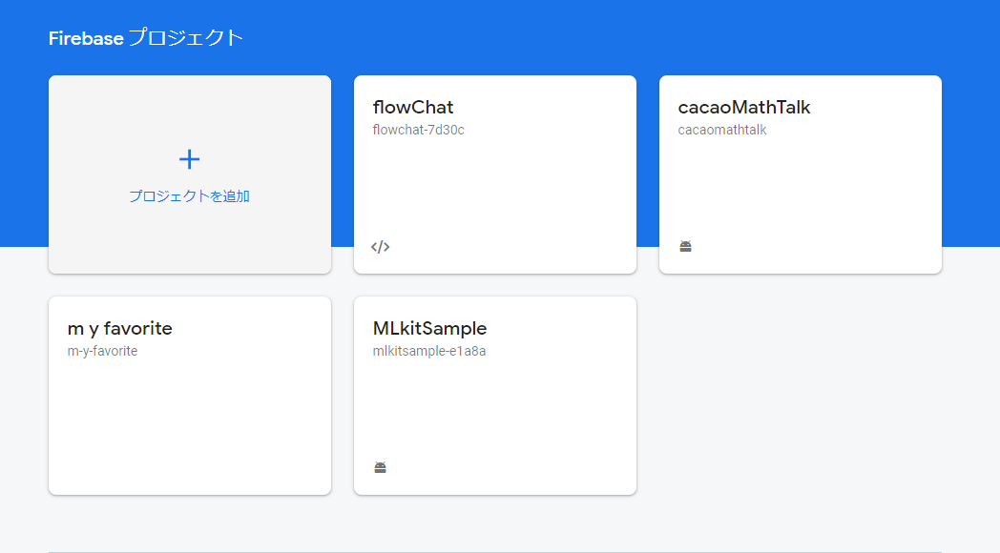

2. Android アプリを追加する

   

3. Android パッケージ名を"com.example.place"としてアプリを登録

   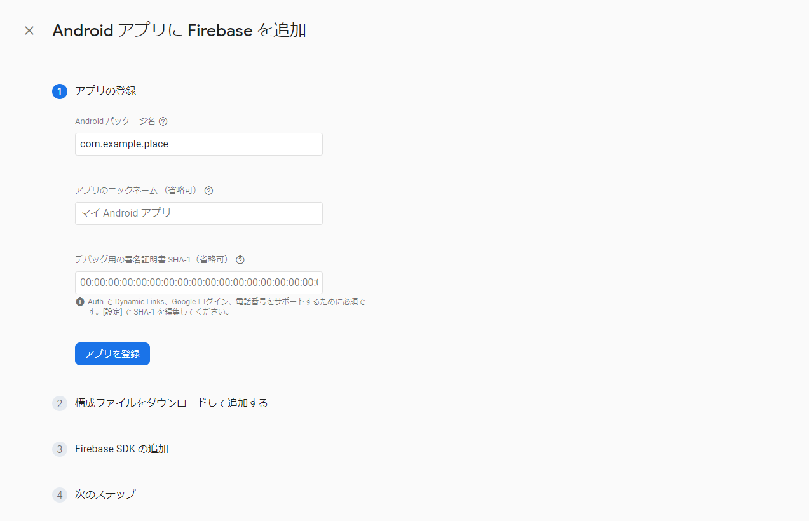

4. googlr-service.json をダウンロードして指示通りの位置に配置する

   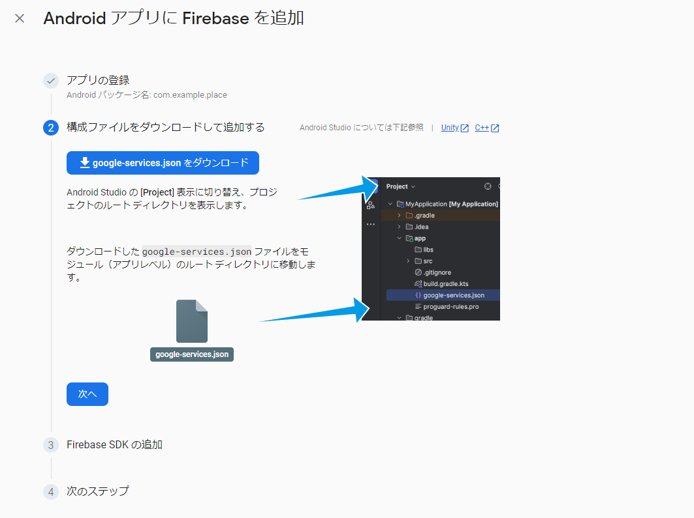

5. Firebase SDK はバージョンが異なる場合はバージョンを Android アプリの方で合わせておく

   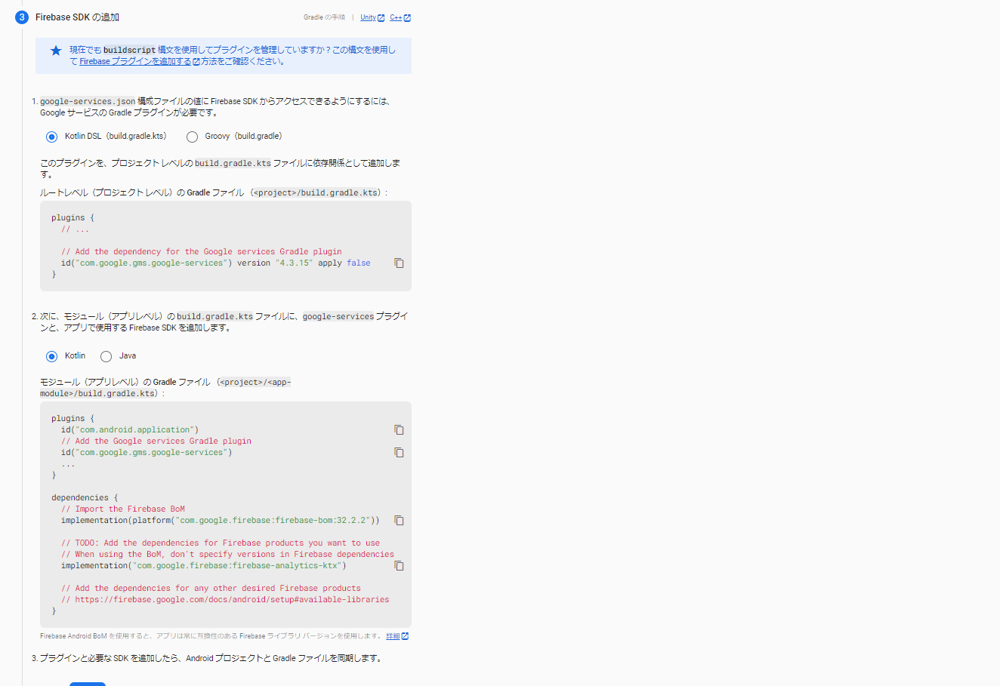

6. あとは指示通りにコンソールに進む

   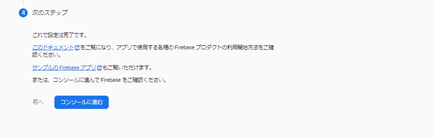

## Firestore の設定

- アプリのデータ保存に必要

1.  コンソールから Firestore の設定画面に行きデータベースの作成をする

    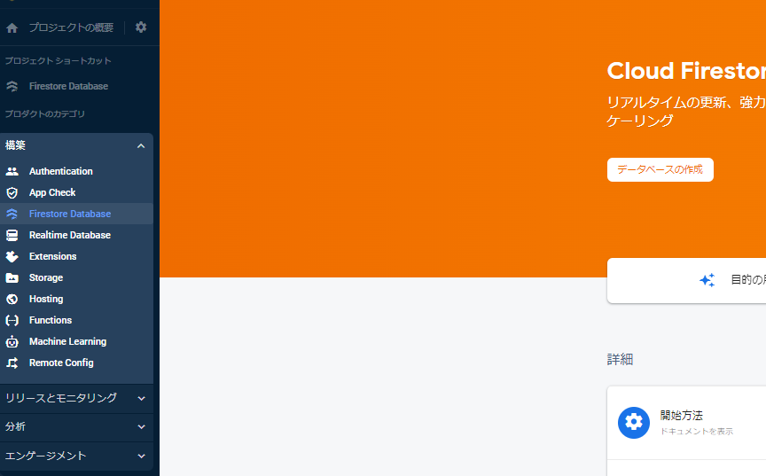

2.  モードはとりあえずテストモードでいい

    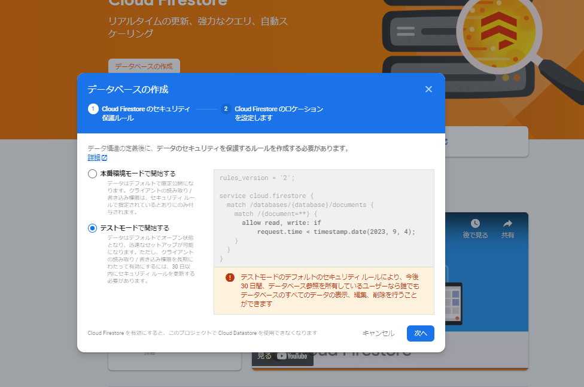

3.  ロケーションは自由で良し

    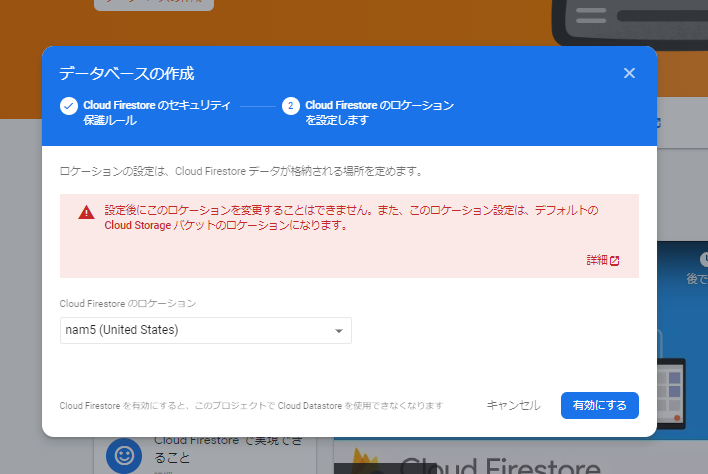

4.  設定完了するとこの画面に行きつく(いかなければ reload とかする)

    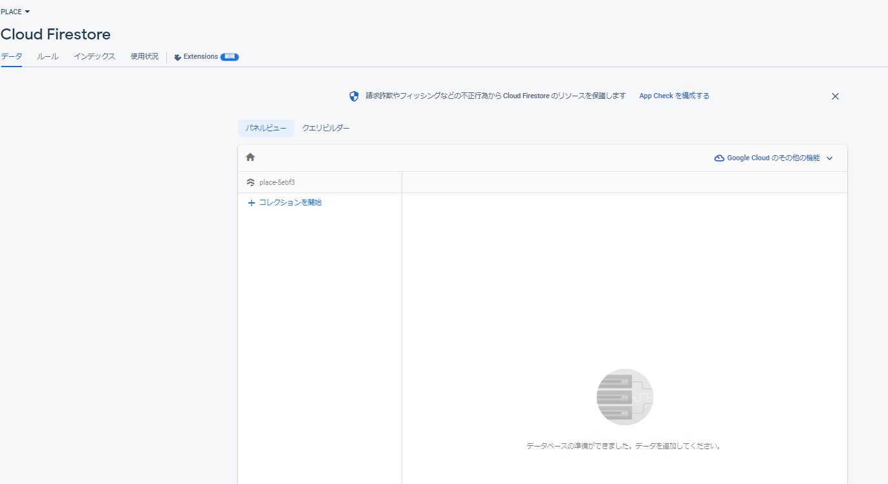

5.  ルールのところで"ルール json"のようにルールを設定する

    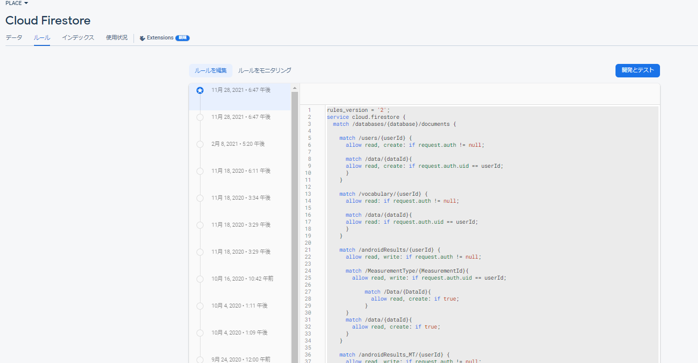
    <details><summary>ルール json</summary>

    ```json
    rules_version = '2';
    service cloud.firestore {
    match /databases/{database}/documents {

        match /users/{userId} {
        allow read, create: if request.auth != null;

        match /data/{dataId}{
        allow read, create: if request.auth.uid == userId;
        }
        }

        match /vocabulary/{userId} {
        allow read: if request.auth != null;

        match /data/{dataId}{
        allow read: if request.auth.uid == userId;
        }
        }

        match /androidResults/{userId} {
        allow read, write: if request.auth != null;

        match /MeasurementType/{MeasurementId}{
            allow read, write: if request.auth.uid == userId;

                match /Data/{DataId}{
                                allow read, create: if true;
                    }
        }
        match /data/{dataId}{
            allow read, create: if true;
        }
        }

        match /androidResults_MT/{userId} {
        allow read, write: if request.auth != null;

        match /MeasurementType/{MeasurementId}{
            allow read, write: if request.auth.uid == userId;

                match /Data/{DataId}{
                                allow read, create: if true;
                    }
        }
        match /data/{dataId}{
            allow read, create: if true;
        }
        }

        match /engTest/{documentId}{
            allow read, create: if true;
            match /data/{dataId}{
            allow read, create: if true;
            }
        }

        match /engTest_MT/{documentId}{
            allow read, create: if true;
            match /data/{dataId}{
            allow read, create: if true;
            }
        }

        match /engWriteTest/{userId}{
            allow read, create: if true;

        match /data/{dataId}{
            allow read, create: if true;
        }
        }
    }
    }
    ```

    </details>

## Authentication の設定

- ログインのために必要

1. Authentication で`始める`を押す(まだ設定したことがない場合)
   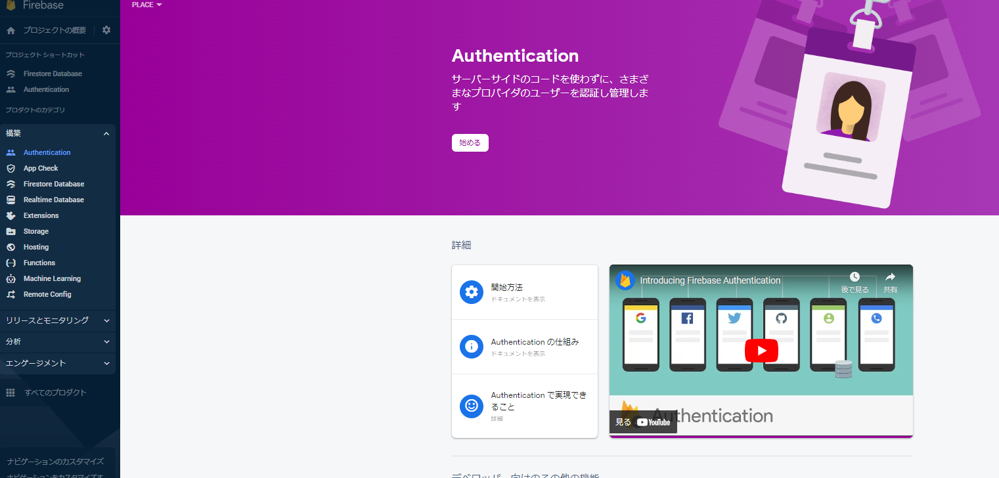

2. サインインメソッドで"メール/パスワード"を有効にする
   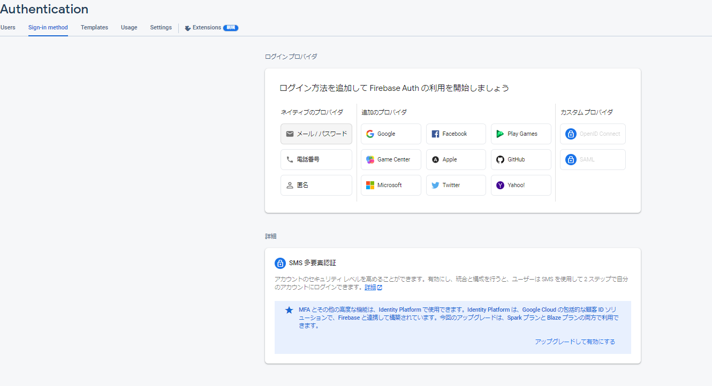
